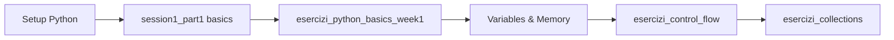
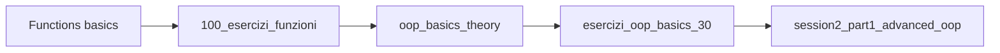
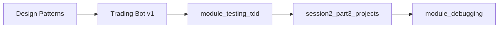
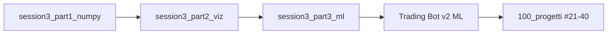
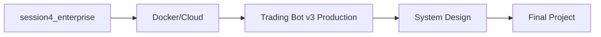

# 🗺️ MAPPA COMPLETA PYTHON MASTER - TUTTI I MATERIALI

## 📊 STRUTTURA DEL CORSO

```
🎓 PYTHON MASTER COURSE
│
├── 📚 TEORIA (4 Sessioni + Moduli)
│   ├── SESSION 1: FUNDAMENTALS
│   │   ├── session1_part1_fundamentals.py [1400 lines]
│   │   ├── session1_part2_projects.py [1200 lines]
│   │   ├── session1_part3_advanced.py [800 lines]
│   │   └── session1_notebook.ipynb
│   │
│   ├── SESSION 2: ADVANCED
│   │   ├── session2_part1_advanced_oop.py [1500 lines]
│   │   ├── session2_part2_concurrency.py [1300 lines]
│   │   ├── session2_part3_projects.py [1400 lines]
│   │   └── session2_part4_testing.py [900 lines]
│   │
│   ├── SESSION 3: DATA SCIENCE & ML
│   │   ├── session3_part1_numpy_pandas.py [1200 lines]
│   │   ├── session3_part2_visualization.py [900 lines]
│   │   ├── session3_part3_machine_learning.py [1400 lines]
│   │   ├── session3_part4_projects.py [1600 lines]
│   │   └── session3_part5_deep_learning.py [1100 lines]
│   │
│   ├── SESSION 4: PRODUCTION
│   │   ├── session4_part4_enterprise_projects.py [2000 lines]
│   │   └── session4_part5_system_design.py [1800 lines]
│   │
│   └── MODULI PROFESSIONALI
│       ├── module_git_professional.py
│       ├── module_debugging_methodology.py
│       ├── module_code_review.py
│       ├── module_testing_tdd.py
│       ├── module_security_fundamentals.py
│       ├── module_system_architecture.py
│       ├── module_legacy_code.py
│       └── oop_basics_theory.py [NEW]
│
├── 💻 ESERCIZI (500+ totali)
│   ├── BASICS
│   │   ├── esercizi_python_basics_week1.py [15 ex]
│   │   ├── esercizi_control_flow_complete.py [15 ex]
│   │   └── esercizi_collections_complete.py [20 ex]
│   │
│   ├── INTERMEDIATE
│   │   ├── 100_esercizi_funzioni_stringhe.py [100 ex]
│   │   ├── esercizi_oop_basics_30.py [30 ex]
│   │   └── first_50_exercises_interactive.py [50 ex]
│   │
│   └── ADVANCED
│       ├── 500_exercises_phase1.md [270 ex planned]
│       └── [PDF] 201_Python_Programming_Exercises.pdf
│
├── 🚀 PROGETTI (20+ completi)
│   ├── SESSIONI (15 progetti)
│   │   ├── Session 1: Trading Bot v1, Text Adventure, Automation Tool
│   │   ├── Session 2: REST API, Chat System, Web Scraper, Task Queue
│   │   ├── Session 3: Analytics Pipeline, ML API, Dashboard, AI Trading Bot
│   │   └── Session 4: 5 Enterprise Systems
│   │
│   └── FUTURISTICI (100 progetti)
│       └── 100_progetti_futuristici.py
│
└── 📅 TIMELINE & DOCS
    ├── python_master_timeline_definitiva.md [60 giorni]
    ├── python_master_complete_path.md
    └── README files per ogni sessione
```

## 🔗 COLLEGAMENTI E DIPENDENZE

### **WEEK 1-2: FOUNDATIONS**


### **WEEK 3-4: FUNCTIONS & OOP**


### **WEEK 5-6: PROJECTS & PATTERNS**


### **WEEK 7-8: DATA SCIENCE**


### **WEEK 9: PRODUCTION**


## 📈 PERCORSI DI APPRENDIMENTO

### **PERCORSO 1: TRADING BOT EVOLUTION**
```
Day 1-10:   Basic calculations → session1_part1
Day 11-20:  OOP structure → oop_basics + session2_part1
Day 21-30:  Patterns & Testing → session2_part3
Day 31-40:  ML integration → session3_part3
Day 41-50:  Production system → session4_part4
Day 51-60:  Complete platform → Final project
```

### **PERCORSO 2: FULL-STACK DEVELOPER**
```
Foundation → OOP → Testing → APIs → Databases → Cloud → Production
```

### **PERCORSO 3: DATA SCIENTIST**
```
Python basics → NumPy/Pandas → Visualization → ML → Deep Learning → MLOps
```

## 🎯 MAPPATURA FILE PER OBIETTIVO

### **"Voglio costruire un Trading Bot"**
1. `esercizi_python_basics_week1.py` - Fondamenti
2. `oop_basics_theory.py` - Struttura OOP
3. `session1_part2_projects.py` - Trading Bot v1
4. `session2_part1_advanced_oop.py` - Patterns
5. `session3_part3_machine_learning.py` - ML predictions
6. `session3_part4_projects.py` - AI Trading Bot
7. `session4_part4_enterprise_projects.py` - Production system
8. `100_progetti_futuristici.py` - Projects #30, #40, #51, #56

### **"Voglio padroneggiare Python"**
1. Tutte le sessioni in ordine (1→2→3→4)
2. Tutti gli esercizi progressivamente
3. Almeno 5 progetti completi
4. Tutti i moduli professionali

### **"Voglio un lavoro come Developer"**
Focus su:
- `session2_*` - Advanced Python
- `module_testing_tdd.py`
- `module_code_review.py`
- `module_git_professional.py`
- `session2_part3_projects.py` - Portfolio projects

## 📊 STATISTICHE COMPLETE

```python
course_stats = {
    "teoria": {
        "files": 19,
        "lines_of_code": 25000+,
        "concepts": 200+
    },
    "esercizi": {
        "total": 516,
        "completati": 230,
        "da_creare": 286
    },
    "progetti": {
        "nelle_sessioni": 15,
        "futuristici": 100,
        "trading_bot_versions": 4
    },
    "timeline": {
        "giorni": 60,
        "ore_totali": 200,
        "ore_per_giorno": "3-4"
    }
}
```

## 🔍 DOVE TROVARE COSA

### **Concetti Base**
- Variables: `session1_part1_fundamentals.py` → Section 2
- Control Flow: `esercizi_control_flow_complete.py`
- Functions: `100_esercizi_funzioni_stringhe.py`
- OOP: `oop_basics_theory.py` + `session2_part1`

### **Concetti Avanzati**
- Async: `session2_part2_concurrency.py` → Section 2
- Decorators: `session1_part1` → Section 5
- Testing: `session2_part4_testing.py`
- ML: `session3_part3_machine_learning.py`

### **Progetti Pratici**
- REST API: `session2_part3_projects.py` → Project 1
- Web Scraper: `session2_part3_projects.py` → Project 3
- ML Pipeline: `session3_part4_projects.py` → Project 1
- Trading Bot: Multiple versions across sessions

## ✅ CHECKLIST NAVIGAZIONE

Per iniziare:
- [ ] Leggi `python_master_timeline_definitiva.md`
- [ ] Apri `session1_readme.md` per overview
- [ ] Inizia con `session1_part1_fundamentals.py`
- [ ] Fai `esercizi_python_basics_week1.py`
- [ ] Segui la timeline giorno per giorno

## 🎯 QUICK LINKS

**INIZIA QUI**: `session1_part1_fundamentals.py`
**TIMELINE**: `python_master_timeline_definitiva.md`
**TRADING BOT**: Cerca "TradingBot" nei file
**PROGETTI**: `100_progetti_futuristici.py`
**TESTING**: `module_testing_tdd.py`
